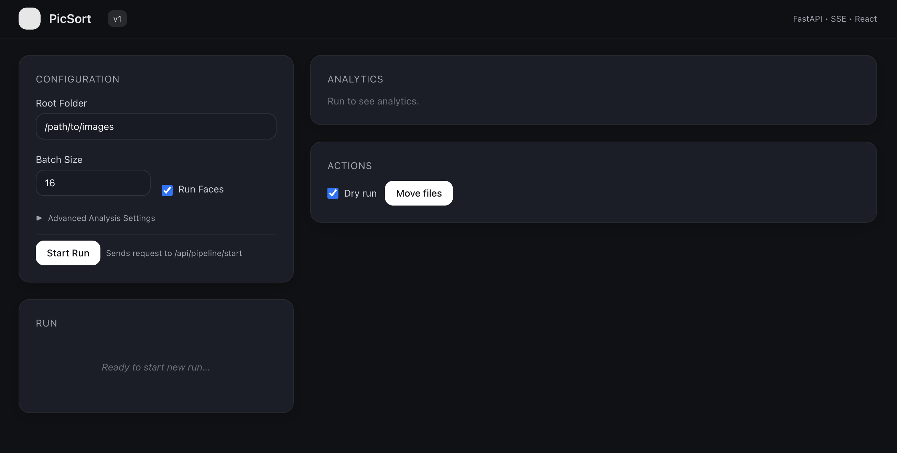

# PicSort 📸

**PicSort** is an intelligent, privacy-first photo organization tool that uses local AI to sort, curate, and group your photo collection. It runs entirely on your machine, ensuring your personal memories never leave your device.



## ✨ Key Features

- **Local AI Processing**: Powered by YOLOv8, RetinaFace, and FaceNet running locally (CPU/MPS/CUDA).
- **Smart Curation**:
  - **Blur Detection**: Automatically identifies and filters out blurry or low-quality images.
  - **Duplicate Removal**: Finds and groups duplicate or near-duplicate images.
- **Intelligent Grouping**:
  - **Face Recognition**: Groups photos by people using advanced facial clustering.
  - **Scene Understanding**: Categorizes images into "Landscapes", "Documents", "Screenshots", etc.
- **Interactive UI**:
  - Real-time progress monitoring.
  - Manual review of "Moves" before applying them.
  - Advanced configuration for power users.

## 🚀 Pipeline Overview

PicSort processes your images in four stages:

1.  **Stage A (Focus & Quality)**: Analyzes image sharpness and depth-of-field to separate high-quality shots from blurry messes.
2.  **Stage B (Faces)**: Detects faces and clusters them by identity.
3.  **Stage C (Scene)**: Uses CLIP/YOLO to understand the content of images without people (e.g., "Nature", "Urban").
4.  **Stage D (Grouping)**: Synthesizes all data to propose a final folder structure (e.g., `2023/Holidays/Person_A`).

## 🛠️ Installation

### Prerequisites
- **Python 3.10+**
- **Node.js 18+**

### Backend Setup
1.  Navigate to the backend directory:
    ```bash
    cd backend
    ```
2.  Install dependencies (using Poetry or pip):
    ```bash
    pip install -r requirements.txt
    ```
3.  Start the API server:
    ```bash
    uvicorn api.app:app --reload
    ```

### Frontend Setup
1.  Navigate to the frontend directory:
    ```bash
    cd frontend
    ```
2.  Install dependencies:
    ```bash
    npm install
    ```
3.  Start the development server:
    ```bash
    npm run dev
    ```

## 📖 Usage Guide

1.  **Open the App**: Navigate to `http://localhost:5173`.
2.  **Select Root Folder**: Enter the absolute path to your photo collection in the "Root Folder" input.
3.  **Configure Run**:
    - **Batch Size**: Adjust based on your VRAM/RAM (default: 16).
    - **Run Faces**: Toggle face detection on/off.
4.  **Start Processing**: Click **Start Run**. The panel will show real-time logs and progress.
5.  **Review Results**: Once complete, charts will show the distribution of your photos.
6.  **Move Files**: Use the "Dry Run" toggle to preview changes, then click "Move Files" to organize your directory.

### ⚙️ Advanced Settings

For power users, click the **"▶ Advanced Analysis Settings"** toggle to tweak the AI sensitivity:

| Parameter | Description | Default | Effect |
| :--- | :--- | :--- | :--- |
| **Subject Sharpness** | Minimum sharpness score for subjects. | `10.0` | Higher = stricter quality control. |
| **Background Sharpness** | Threshold for background blur. | `8.0` | Used to detect depth-of-field. |
| **Person Confidence** | Min confidence to detect a person. | `0.6` | Decrease if people are missed. |
| **Face Confidence** | Min confidence to detect a face. | `0.6` | threshold for face bounding boxes. |
| **Face Similarity** | Strictness of identity clustering. | `0.65` | **Higher** = Stricter (more groups). **Lower** = Loose (merges groups). |

## 🏗️ Tech Stack

- **Frontend**: React, TypeScript, Vite, TailwindCSS, Zustand, ECharts.
- **Backend**: FastAPI, PyTorch, Ultralytics YOLO, scikit-learn.
- **Communication**: REST API + Server-Sent Events (SSE) for real-time streaming.

## 📄 License

MIT License.